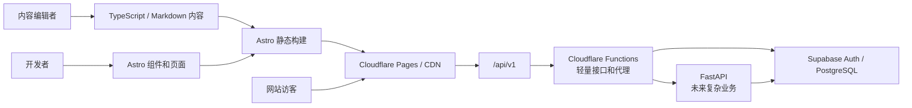

# Sunbridge Academy 目标架构设计

最后审阅：2026-06-15

## 1. 目标

这套架构需要同时解决三个问题：

1. 文案、课程、图片和联系方式可以分开管理。
2. 页头、页脚、SEO 和双语逻辑只维护一份。
3. 现在保持 Cloudflare 上的高速静态站，未来增加表单、登录和教务后端时不推翻前端。

推荐目标：

```text
Astro 静态前台
  + 类型化共享内容
  + 少量客户端交互
  + /api/v1 统一接口边界
  + Cloudflare Pages
  + Supabase
  + 可选 FastAPI 业务服务
```

## 2. 总体架构



核心原则：

- 公开内容默认在构建时生成，不要求数据库在线才能打开网站。
- 页面不直接包含重复的页头、页脚和联系方式。
- 页面不直接依赖具体后端实现，只依赖版本化 API。
- 后端不可用时，静态宣传站仍然正常访问。

## 3. 推荐目录

第一阶段使用单仓库：

```text
kids_club_website/
  apps/
    web/
      src/
        components/
          Header.astro
          Footer.astro
          HomePage.astro
          ProgrammesPage.astro
          AboutPage.astro
          CampPage.astro
          ContactPage.astro
        layouts/
          BaseLayout.astro
          ContentLayout.astro
        pages/
          index.astro
          about.astro
          programmes.astro
          holiday-camp.astro
          contact.astro
          zh/
        data/
          site.ts
        lib/
          api/
            client.ts
            contracts.ts
          i18n/
          validation/
        styles/
      public/
        images/
        _headers
        _redirects
      astro.config.mjs
      package.json
  packages/
    contracts/
      README.md
  services/
    api/
      README.md
  docs/
  supabase/
```

`packages/contracts` 和 `services/api` 在后端开始开发前只保留说明文件，不提前制造空工程和依赖。

## 4. 内容管理

### 4.1 内容分类

| 内容 | 存放位置 | 管理方式 |
| --- | --- | --- |
| 品牌、邮箱、导航和全站短文案 | `data/site.ts` | 全站唯一来源 |
| Holiday Camp、Badminton、Guitar、AI Skills | `components/HomePage.astro` 与 `components/ProgrammesPage.astro` | 英文和中文成对维护 |
| About、Holiday Camp、Contact 文案 | 对应共享页面组件 | 英文和中文成对维护 |
| 图片 | `public/images/` | 统一命名和压缩 |
| SEO 字段 | 共享页面组件 | Astro 类型检查和构建验证 |

当前公开内容规模较小，使用类型化共享组件比为每个活动建立独立 Markdown 更直接。未来只有在独立项目数量明显增加、需要非开发人员频繁编辑或需要发布状态管理时，再引入 Astro Content Collections。

### 4.2 双语 URL

推荐：

```text
/                 英文首页
/about/           英文 About
/programmes/      英文项目方向
/zh/              中文首页
/zh/about/        中文 About
/zh/programmes/
```

英文继续作为默认语言。语言切换使用真实 URL，不再依赖 JavaScript 替换整页文本。

优点：

- 搜索引擎可以分别索引两种语言。
- 页面源代码本身就是正确语言。
- JavaScript 关闭后仍然可用。
- 分享链接时能明确指向中文或英文版本。

现有 `.html` URL 通过 `public/_redirects` 保留兼容，不直接制造 404。

## 5. 前端边界

### 构建时完成

- 页面生成
- 内容校验
- SEO 和 canonical
- 双语路由
- 图片优化
- sitemap

### 浏览器中完成

- 手机菜单
- 少量进入动画
- 必要的表单交互
- 登录后的用户交互

不建议把整个宣传站改成 SPA。宣传内容应优先输出静态 HTML，减少 JavaScript、提高稳定性并改善 SEO。

## 6. 后端预留

前端只调用：

```text
/api/v1/contact
/api/v1/auth/*
/api/v1/profile
/api/v1/bookings
/api/v1/students
```

不要让页面组件直接依赖 Supabase 表结构，也不要在浏览器暴露 Supabase service role key。

### 阶段 A：轻量动态能力

使用 Cloudflare Pages Functions：

- 联系表单
- CAPTCHA 校验
- 邮件或 webhook 转发
- API 代理
- 安全响应头和速率限制

Functions 只匹配 `/api/*`。静态页面不应经过 Function，以保持静态请求性能和免费额度。

### 阶段 B：账户和基础数据

使用 Supabase：

- Auth 管理身份和会话
- PostgreSQL 保存 profile 和关系数据
- RLS 控制行级访问
- Storage 保存需要权限控制的文件

### 阶段 C：复杂教务业务

当出现课时交易、考勤、支付、成长报告或复杂通知时，再引入 FastAPI：

- FastAPI 部署在独立服务上。
- 使用 `api.<domain>` 或由 Cloudflare `/api/v1/*` 代理。
- 数据库继续使用 PostgreSQL。
- OpenAPI 作为前后端契约来源。
- 课时扣减等操作必须使用数据库事务和审计日志。

这样从 Functions 切换到 FastAPI 时，前端 URL 和调用方式不需要改变。

## 7. Cloudflare 设计

当前 GitHub 集成项目使用 Cloudflare Workers Static Assets：

```text
Root directory: repository root
Build command: npm run build
Deploy command: npx wrangler deploy
Static assets: apps/web/dist
Production branch: main
```

建议配置：

- Preview deployments 开启。
- Build watch paths 只包含 `apps/web/*`、`packages/*` 和相关配置。
- `wrangler.jsonc` 定义 Workers 项目名称、部署前构建命令和静态资源目录。
- `public/_headers` 管理缓存和安全头。
- `public/_redirects` 管理旧 URL 和 canonical 域名跳转。
- Preview 和 Production 使用不同环境变量。
- Functions 存在时生成 `_routes.json`，只让 `/api/*` 触发 Functions。

未来如果动态边缘逻辑占比明显增加，可以把同一个 Astro 构建迁移到 Cloudflare Workers Static Assets；当前没有必要为了这一可能性提前迁移。

## 8. 内容后台

不建议现在立刻引入 CMS。

推荐顺序：

1. Git 中的 Markdown/YAML，配合 schema 和 Preview。
2. 内容更新频率变高后，增加 Git-based CMS。
3. 多人编辑、审批和定时发布成为真实需求后，再接 Headless CMS。

内容读取必须经过独立 loader。未来换成 CMS 时，只替换 loader，不重写页面组件。

## 9. 迁移阶段

### Phase 1：建立可构建骨架

- 创建 `apps/web` Astro 静态项目。
- 建立共享 Header、Footer 和 Layout。
- 配置 Cloudflare Preview，但暂不切生产。

### Phase 2：迁移内容

- 把联系方式、导航和全站 UI 文案移到 data 文件。
- 把四个公开项目和页面文案放入共享双语组件。
- 同时生成英文根路由和 `/zh/` 路由。

### Phase 3：兼容和切换

- 添加旧 URL redirects。
- 比较新旧页面的桌面、手机、SEO 和链接。
- Preview 验收后切换 Cloudflare build root 和 output。
- 保留上一个生产部署作为回滚点。

### Phase 4：动态能力

- 仅在真实需求出现时增加 `/api/v1`。
- 先 Functions 和 Supabase，后续复杂业务再接 FastAPI。

## 10. 不推荐的方案

- 继续复制粘贴多份 HTML 页头和页脚。
- 把全部双语内容长期放在一个大型 `js/main.js` 字典中。
- 为宣传站改成纯客户端 React SPA。
- 现在就建立 Redis、消息队列和完整 FastAPI 服务。
- 让前端组件直接操作业务数据库表。
- 把 Pages Functions 放在所有请求前面。

## 11. 验收标准

目标架构迁移完成后：

- 修改一次电话即可更新全站。
- 修改一个 Header 组件即可更新所有页面。
- 五个项目方向可以在共享页面组件中集中编辑。
- 中英文页面都经过 Astro 类型检查和静态构建。
- 旧公开 URL 不产生 404。
- Cloudflare Preview 和 Production 构建可重复。
- 静态页面不依赖 Functions 或数据库。
- 后端可以在不修改页面结构的情况下接入 `/api/v1`。
