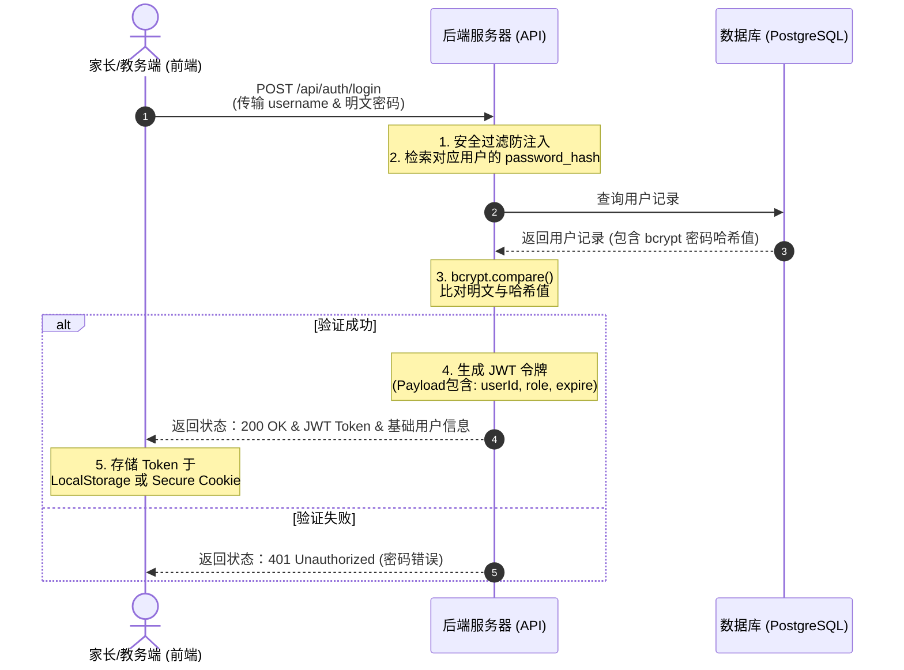

# 历史后端架构草案

> 状态：已归档，不是当前实施标准。
>
> 这份文件保留早期教务、课时和成长报告的需求探索。自定义密码、JWT、Redis、消息队列和云服务选型已经过时或尚未批准。当前目标架构以 `docs/TARGET_ARCHITECTURE.md`、`ARCHITECTURE.md` 和 Supabase 方案为准。

# Sunbridge - 后端与数据库系统架构规划说明书

本规划书旨在深度剖析本学院网站从目前的**静态前端展示**升级为**动态教务与成长管理平台**时的后端技术架构设计、数据库表结构模型、以及核心业务系统的技术落地路径。

---

## 目录
1. [系统总体设计理念](#一系统总体设计理念)
2. [用户认证与登录系统设计](#二用户认证与登录系统设计)
3. [数据库表结构设计 (Database Schema)](#三数据库表结构设计-database-schema)
4. [核心业务模块与消课逻辑](#四核心业务模块与消课逻辑)
5. [后端技术栈与基础设施推荐](#五后端技术栈与基础设施推荐)
6. [一期系统落地执行路径](#六一期系统落地执行路径)

---

## 一、系统总体设计理念

Sunbridge 是一家结合了**体育（羽毛球）**、**文化（学科同步）**与**科技（AI/编程）**的跨界培训机构。其教务与学员管理系统在设计上必须具备以下特征：
1. **多租户/多角色隔离**：同一个家长可能绑定多个孩子，不同类型的老师（羽毛球教练 vs 学科教师 vs 编程导师）拥有不同的数据录入权限。
2. **动静分离的成长记录**：运动数据侧重于视频、雷达图与考勤；编程学科侧重于代码作品链接与错题集。
3. **高频消课与强通知属性**：课时余额是家长的核心敏感数据，每一次划消课时都必须有严格的幂等性验证和即时微信/短信通知通知。

---

## 二、用户认证与登录系统设计

为了保证家长和教务端的数据安全，登录认证系统采用主流的 **前后端分离 JWT 令牌方案**。



### 1. 安全防范规范
* **密码哈希存储**：数据库中严禁出现明文密码。注册时密码必须使用 `bcrypt` 或 `Argon2` 进行单向加盐哈希运算，并将生成的 `password_hash` 存入数据库。
* **传输加密**：所有登录与数据接口必须强制运行在 `HTTPS` 协议下，防止网络数据包监听获取明文密码或 Token。
* **Token 防窃取**：推荐将 JWT Token 写入浏览器的 `HttpOnly` Cookie 中，此属性可以防止前端 JavaScript 通过 `document.cookie` 窃取令牌，天然免疫大部分 XSS 跨站脚本攻击。

---

## 三、数据库表结构设计 (Database Schema)

以下为支持一期教务消课与成长报告功能所必需的数据库表（以 PostgreSQL 规范为例）：

### 1. 用户表 (`users`)
存储系统所有可登录的人员基础信息及身份角色。

| 字段名 (Field) | 类型 (Type) | 约束 (Constraint) | 说明 (Description) |
| :--- | :--- | :--- | :--- |
| `id` | `UUID` | PRIMARY KEY, DEFAULT gen_random_uuid() | 唯一用户ID |
| `username` | `VARCHAR(50)` | UNIQUE, NOT NULL | 登录名 |
| `phone` | `VARCHAR(20)` | UNIQUE, NOT NULL | 手机号 (用于短信接收/登录) |
| `email` | `VARCHAR(100)` | UNIQUE | 邮箱 (接收评估周报) |
| `password_hash`| `VARCHAR(255)` | NOT NULL | 加密密码哈希值 |
| `role` | `VARCHAR(20)` | NOT NULL | 角色: `parent` (家长), `teacher` (教师), `admin` (管理员) |
| `created_at` | `TIMESTAMP` | DEFAULT CURRENT_TIMESTAMP | 注册时间 |

### 2. 学员表 (`students`)
一个家长（User）可以绑定多个孩子（Student）。

| 字段名 (Field) | 类型 (Type) | 约束 (Constraint) | 说明 (Description) |
| :--- | :--- | :--- | :--- |
| `id` | `INT` | PRIMARY KEY, AUTO_INCREMENT | 唯一学员ID |
| `parent_id` | `UUID` | FOREIGN KEY REFERENCES `users(id)` | 关联的家长ID |
| `name` | `VARCHAR(50)` | NOT NULL | 孩子姓名 |
| `birthday` | `DATE` | NOT NULL | 生日 (自动计算年龄段) |
| `gender` | `VARCHAR(10)` | - | 性别 |
| `school` | `VARCHAR(100)` | - | 就读公立学校 |
| `badminton_credit`| `INT` | DEFAULT 0 | 剩余羽毛球课时数 |
| `academic_credit`| `INT` | DEFAULT 0 | 剩余学科辅导课时数 |
| `tech_credit` | `INT` | DEFAULT 0 | 剩余编程课时数 |

### 3. 课程表 (`courses`)
定义机构开设的核心科目。

| 字段名 (Field) | 类型 (Type) | 约束 (Constraint) | 说明 (Description) |
| :--- | :--- | :--- | :--- |
| `id` | `INT` | PRIMARY KEY, AUTO_INCREMENT | 课程ID |
| `type` | `VARCHAR(20)` | NOT NULL | 科目大类: `badminton`, `academic`, `tech` |
| `title` | `VARCHAR(100)` | NOT NULL | 课程名称 (如: Python智能小车班) |
| `description` | `TEXT` | - | 课程大纲简述 |
| `price_per_class`| `DECIMAL(10,2)`| NOT NULL | 折合单课时单价 |

### 4. 课时变动日志表 (`credit_logs`)
每次充值或扣减课时必须有流水，方便对账。

| 字段名 (Field) | 类型 (Type) | 约束 (Constraint) | 说明 (Description) |
| :--- | :--- | :--- | :--- |
| `id` | `BIGINT` | PRIMARY KEY, AUTO_INCREMENT | 日志自增ID |
| `student_id` | `INT` | FOREIGN KEY REFERENCES `students(id)` | 学员ID |
| `course_type` | `VARCHAR(20)` | NOT NULL | 变动科目: `badminton`, `academic`, `tech` |
| `amount` | `INT` | NOT NULL | 变动数量 (如: +30 充值, -1 上课) |
| `action_type` | `VARCHAR(20)` | NOT NULL | 类型: `buy` (购买), `deduct` (消课), `refund` (退费) |
| `operator_id` | `UUID` | FOREIGN KEY REFERENCES `users(id)` | 操作人用户ID |
| `remarks` | `VARCHAR(255)` | - | 备注 (例: 周六上午L2班到课扣减) |
| `created_at` | `TIMESTAMP` | DEFAULT CURRENT_TIMESTAMP | 记录时间 |

### 5. 学员成长记录表 (`growth_reports`)
每周/每月由教练和老师录入的数据，展示在家长后台。

| 字段名 (Field) | 类型 (Type) | 约束 (Constraint) | 说明 (Description) |
| :--- | :--- | :--- | :--- |
| `id` | `INT` | PRIMARY KEY, AUTO_INCREMENT | 报告ID |
| `student_id` | `INT` | FOREIGN KEY REFERENCES `students(id)` | 学员ID |
| `reporter_id` | `UUID` | FOREIGN KEY REFERENCES `users(id)` | 编写报告的教师ID |
| `report_date` | `DATE` | NOT NULL | 报告日期 |
| `badminton_metrics`| `JSONB` | - | 羽毛球专项数据 (步法/力量/耐力/战术/敏捷 雷达图数据) |
| `academic_metrics` | `JSONB` | - | 学科学分及错题集 (错题原题URL/知识漏洞大纲) |
| `tech_metrics` | `JSONB` | - | 编程作业与创意展示 (项目运行链接/代码逻辑评估) |
| `teacher_comment` | `TEXT` | NOT NULL | 教师评语 |
| `media_urls` | `TEXT[]` | - | 现场动作或作品的视频、图片云存储地址数组 |

---

## 四、核心业务模块与消课逻辑

### 1. 核心消课事务控制 (Deduct Transaction)
为了防止高并发请求下产生“双重扣减”或“负课时”的情况，消课逻辑必须运行在一个**数据库事务**中，并且在扣减课时前执行行级锁（`SELECT ... FOR UPDATE`）。

```python
# FastAPI/SQLAlchemy 伪代码示例：
@app.post("/api/classes/attendance")
def record_attendance(attendance: AttendanceSchema, db: Session = Depends(get_db)):
    # 开启事务
    try:
        # 1. 锁定并查询学员课时余额
        student = db.query(Student).filter(Student.id == attendance.student_id).with_for_update().first()
        
        # 2. 判断对应课程课时是否充足
        credit_field = f"{attendance.course_type}_credit"
        current_credit = getattr(student, credit_field)
        if current_credit < 1:
            raise HTTPException(status_code=400, detail="课时不足，无法签到！")
            
        # 3. 扣减 1 课时
        setattr(student, credit_field, current_credit - 1)
        
        # 4. 插入消课明细流水日志 (用于追溯)
        log = CreditLog(
            student_id=student.id,
            course_type=attendance.course_type,
            amount=-1,
            action_type="deduct",
            operator_id=attendance.operator_id,
            remarks=f"上课签到扣减: {attendance.course_title}"
        )
        db.add(log)
        
        # 5. 提交事务
        db.commit()
        
        # 6. 异步发送通知 (不阻塞主请求)
        send_sms_notification.delay(student.parent_phone, f"您的孩子已成功签到《{attendance.course_title}》，本次扣减 1 课时，剩余课时: {current_credit - 1}。")
        
        return {"success": True, "remaining_credit": current_credit - 1}
    except Exception as e:
        db.rollback() # 失败回滚，确保课时完整性
        raise e
```

### 2. 视频与项目存储方案 (Object Storage Integration)
* 羽毛球动作录像和编程图片文件直接存储在关系型数据库中会严重拉跨数据库读写性能。
* **正确做法**：将文件上传到云端对象存储（如阿里云 OSS / 腾讯云 COS），在数据库中仅保存可访问的 CDN 链接（即上面 `growth_reports` 表中的 `media_urls`）。

---

## 五、技术栈与基础设施推荐

考虑到未来系统的扩展以及与高科技编程课（AI）的教学衔接，我们推荐以下技术选型：

| 组件 (Layer) | 选型一：全栈 Python 方案 (推荐) | 选型二：Node.js 统一技术栈 | 说明 (Justification) |
| :--- | :--- | :--- | :--- |
| **API 开发框架** | **FastAPI** | **NestJS** | FastAPI 极速、支持异步且天然对接 Python 强大的 AI 与科学数据分析生态；NestJS 企业级规范。 |
| **数据库** | **PostgreSQL** | **PostgreSQL** | 完美支持 JSONB 字段（存储非结构化错题、AI对话报告和雷达图），事务控制极佳。 |
| **持久缓存** | **Redis** | **Redis** | 存放高频访问的课表、在线 Token 校验以及接口访问限流。 |
| **对象存储** | **阿里云 OSS** | **七牛云 / 腾讯云 COS** | 存放学员羽毛球训练视频、学科答卷图片及编程截图。 |
| **消息队列** | **Celery** | **BullMQ** | 用于异步发送微信模板通知、短信账单以及夜间错题集 PDF 文件的自动合并生成。 |

---

## 六、一期系统落地执行路径

我们不需要一次性把整个庞大的 ERP 系统开发完成。建议采用**敏捷迭代**的三步走策略：

1. **第一阶段：轻量级数据库接入 (1-2周)**
   - 部署一台轻量服务器，安装 **PostgreSQL** 数据库。
   - 实现用户注册、邮箱/手机验证码登录及 Token 验证。
   - 前端将原本保存在 `localStorage` 的表单数据替换为真正的后端 API 请求。

2. **第二阶段：教务消课与考勤后台 (2-3周)**
   - 增加 `Students` 学员表及消课流水日志。
   - 开发“教师端消课/签到控制台”页面（老师在平板或手机上一键勾选到课，后台扣减课时）。
   - 接入腾讯云/阿里云短信 API，扣课时后实时通知家长。

3. **第三阶段：家长端学员成长主页 (2周)**
   - 结合三大特色，开发“家长看板”：
     - 羽毛球：读取后台录入的步法分值、敏捷分值，在前端生成 HSL 彩色雷达图。
     - 学科学习：提供文件下载（每次课的重难点讲义 PDF）。
     - AI编程：展示孩子在课堂上做的网页或游戏的 iframe 嵌入链接。
